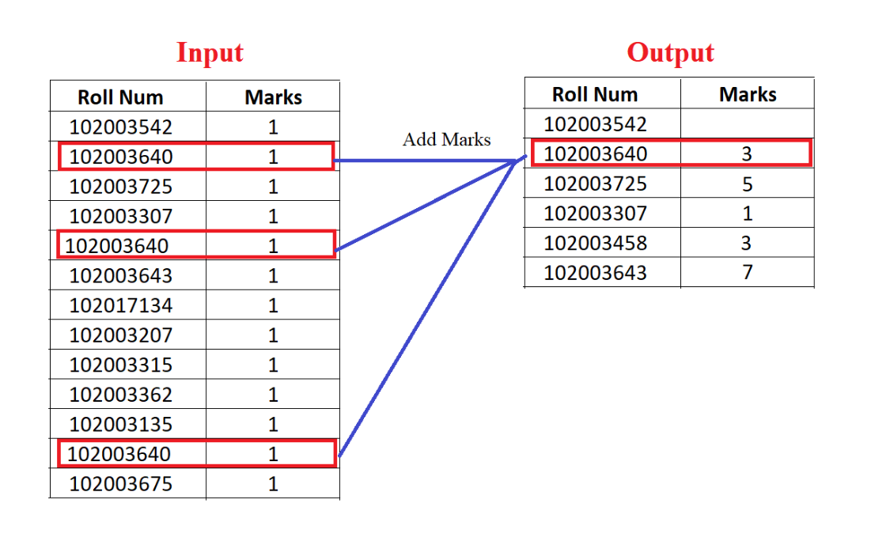

# Marks Adder using Pandas

A Python script that reads marks from a CSV file, groups them by roll number, and outputs the total marks for each student into a new CSV file. Built using `pandas`.


##  Features

- Reads a CSV file with student marks
- Adds up marks grouped by roll number
- Outputs the result to a clean `Output.csv` file
- Simple, efficient, and beginner-friendly


## Sample Input and Output




## How to Run

### 1. Clone the repository

```
git clone https://github.com/YourUsername/Marks-Adder.git
cd Marks-Adder
```
### Install the required package
```
pip install pandas
```
### 3. Run the script


## Project Files

-**marks_adder.py**:	Main script for reading and processing marks  
-**marks.csv**:	Sample input file  
-**Output.csv**:	Auto-generated output file (ignored in repo)  
-**README.md**:	Project overview and instructions


## How It Works
The script reads the CSV, groups rows by "Roll Num", adds the "Marks", and exports the result to a new file named Output.csv.


## Useful For
-Teachers automating mark entry summaries  
-Students learning pandas and data manipulation  
-CSV-based data processing tasks


## Author
Arshia Garg  
Feel free to fork, star, or suggest improvements!


